# wordpaster-vue2-cli-tinymce5
泽优Word一键粘贴控件（WordPaster） for vue2 cli TinyMCE 5示例  
[整合教程](http://www.ncmem.com/doc/view.aspx?id=ecbf47e5258d4e9abc10b286cafadb5b)  

## 演示效果
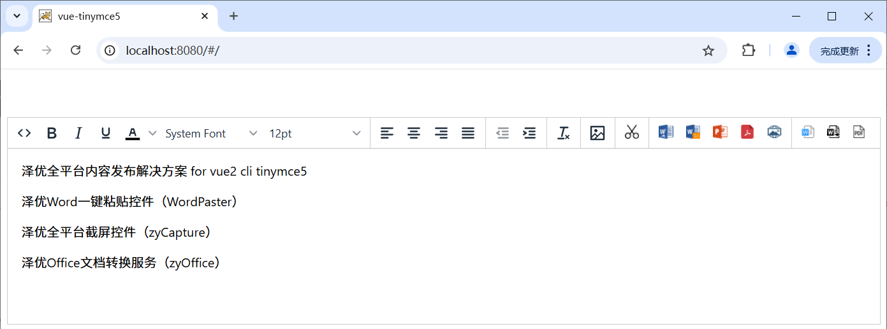

## 测试教程
[视频](https://www.ixigua.com/7232926644107739709)

## 效果
### 编辑器

### 粘贴Word
一键粘贴Word内容，自动上传Word中的图片，保留文字样式。  
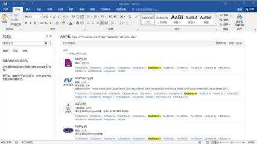
### Word转图片
一键导入Word文件，并将Word文件转换成图片上传到服务器中。  
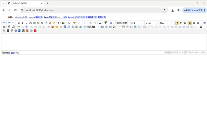
### 导入PPT
一键导入PPT文件，并将PPT转换成图片上传到服务器中。  
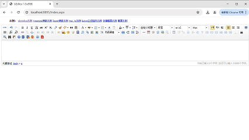
### 导入PDF
一键导入PDF文件，并将PDF转换成图片上传到服务器中。  
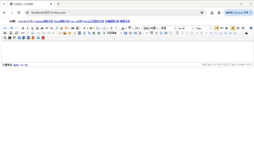
### 上传网络图片
一键自动上传网络图片。自动下载远程服务器图片，自动上传远程服务器图片。  
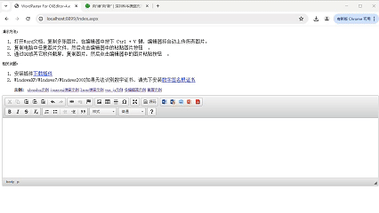

## 介绍
泽优Word一键粘贴控件（WordPaster）是由荆门泽优软件有限公司开发的一个支持多平台(Windows,macOS,Linux)的简化Word内容发布的组件。适用于政府门户，集约化平台，CMS，OA，博客，文档管理系统，微信公众号，微博，自媒体，传媒，在线教育等领域。主要帮助用户解决Word文档图片一键粘贴，PowerPoint一键导入，PDF一键导入的问题，微信公众号内容一键转发，能够支持从ie6到chrome的全部浏览器和常用操作系统（Windows,MacOS,Linux）及信创和国产化环境（龙芯，中标麒麟，银河麒麟，统信UOS）。能够大幅度提高企业信息发布效率，帮助企业实现全媒体平台信息一体化战略。

## 环境支持
平台：Windows,macOS,Linux,Ubuntu,RedHat,CentOS,中标麒麟,银河麒麟,统信UOS  
CPU：x86(海光,兆芯,Intel,AMD),arm(鲲鹏，飞腾),龙芯(mips,LoongArch)  
浏览器：IE6,IE7,IE8,IE9,IE10,IE11,火狐Firefox,谷歌Chrome,Edge,苹果Safari,欧朋Opera,奇安信,360安全浏览器,360极速浏览器,龙芯浏览器,猎豹浏览器,搜狗浏览器,红莲花浏览器,QQ浏览器,傲游浏览器,2345浏览器,115浏览器,UC浏览器,世界之窗浏览器,百度浏览器  
开发语言：ASP,ASP.NET,.NET Core,.NET MVC,JAVA,PHP  
前端框架：VUE,React  
编辑器：FCKEditor,CKEditor,TinyMCE,KindEditor,xhEditor,wangEditor

## 安装控件
[安装Windows控件](http://www.ncmem.com/doc/view.aspx?id=5fa5344143ca4ab88737bab9c52d789c)  
[安装macOS(x86)控件](http://www.ncmem.com/doc/view.aspx?id=56529de30edf4a82b4b38e0635f8566a)  
[安装Linux-deb控件](http://www.ncmem.com/doc/view.aspx?id=f9cac3e62a9b4f87951f50832a51a26a)  
[安装Linux-rpm控件](http://www.ncmem.com/doc/view.aspx?id=ffaf4e3f2894479383a36be68484ed6b)  
视频：  
[Windows控件安装](https://www.ixigua.com/7230761444986651140)  
[macOS控件安装](https://www.ixigua.com/7230760990328455738)  
[linux-x86-deb控件安装](https://www.ixigua.com/7233320491992547840)  
[linux-x86-rpm控件安装](https://www.ixigua.com/7233320275792626187)  
[银河麒麟控件安装](https://www.ixigua.com/7233320033249100340)  
[统信UOS控件安装](https://www.ixigua.com/7231498471449199159)

## 配置
[附加字段](http://www.ncmem.com/doc/view.aspx?id=07ad4a482d4f4706ad9cffebff27c232)  
[自定义Header](http://www.ncmem.com/doc/view.aspx?id=e16aa886b71a4ce199c672612f1a54a2)  
[文件字段名称](http://www.ncmem.com/doc/view.aspx?id=c3ad06c2ae31454cb418ceb2b8da7c45)  
[上传地址](http://www.ncmem.com/doc/view.aspx?id=d88b60a2b0204af1ba62fa66288203ed)  
[Session](http://www.ncmem.com/doc/view.aspx?id=8602DDBF62374D189725BF17367125F3)  
[授权码](http://www.ncmem.com/doc/view.aspx?id=c2057ee93f8449998321376ad0142868)  
[文件名称生成规则](http://www.ncmem.com/doc/view.aspx?id=1234aece527840b6b23fdeaef0ad52bd)  
[自定义域名](http://www.ncmem.com/doc/view.aspx?id=704cd302ebd346b486adf39cf4553936)  
[图片格式和质量](http://www.ncmem.com/doc/view.aspx?id=ede8d454c34c44b1b44d203ecd141f76)  
[控件服务端口](http://www.ncmem.com/doc/view.aspx?id=4f579d2fb5fa4a668c5b72eea7af100b)  
[图片数量限制](http://www.ncmem.com/doc/view.aspx?id=186281241d4d44078f699810b95d821f)

## 集成
[fckeditor 2](http://www.ncmem.com/doc/view.aspx?id=053242ecabee43a790d2b5800118f481)  
[ckeditor 3](http://www.ncmem.com/doc/view.aspx?id=1ffb246c30e54ec9a90e16deb2336dee)  
[ckeditor 4](http://www.ncmem.com/doc/view.aspx?id=db6ee91963f24eeca073f989b7e22a53)  
[ckeditor 5-vue2-cli](http://www.ncmem.com/doc/view.aspx?id=90bb1085224047b4b34fbe14e035111b)  
[kindeditor 3](http://www.ncmem.com/doc/view.aspx?id=b5daeaa2b920463ba7d64e01e1a36438)  
[kindeditor 4](http://www.ncmem.com/doc/view.aspx?id=a6ef42fd803b4c5db7478b8583528978)  
[umeditor 1.2.3](http://www.ncmem.com/doc/view.aspx?id=c42e6208fef54edcb7dc1c00c92caf04)  
[ueditor 1.x](http://www.ncmem.com/doc/view.aspx?id=7ea05dffe5fd4f70a27cfd588f36d5a1)  
[ueditor 1.4.3.3](http://www.ncmem.com/doc/view.aspx?id=44dd78b449104ce6814feb02c4edad69)  
[ueditor 1.5](http://www.ncmem.com/doc/view.aspx?id=85c1eb78bdb44b01a46f6c830aec2ea5)  
[ueditor 1.5-vue2-cli](http://www.ncmem.com/doc/view.aspx?id=12726429b06146eaa6dfb671de8c9c27)  
[neditor](http://www.ncmem.com/doc/view.aspx?id=a2e93666d941441b8e060caa41accc3e)  
[wangEditor 3](http://www.ncmem.com/doc/view.aspx?id=b04553803b2342728721a8c779cfff9b)  
[wangEditor 4-vue2-cli](http://www.ncmem.com/doc/view.aspx?id=9e7eab33cff741098cdc9177c533231c)  
[quill-vue2-cli](http://www.ncmem.com/doc/view.aspx?id=f56f074db7b84332baf3717a919687db)  
[tinymce 3](http://www.ncmem.com/doc/view.aspx?id=342ee058ec764d268ccf0b2d93428377)  
[tinymce 4](http://www.ncmem.com/doc/view.aspx?id=fa29e6587fa84f06a80bfd9b49ec5386)  
[tinymce 5](http://www.ncmem.com/doc/view.aspx?id=377795136b2f4532b2d30fc7bf9f3ae6)  
[tinymce 5-vue2-cli](http://www.ncmem.com/doc/view.aspx?id=fb462c8640ff4ad59590dcc60be14d24)  
[tinymce 6-vue3-cli](http://www.ncmem.com/doc/view.aspx?id=1e404bf0ff854c8ea9b4da75cc0f1dbf)  
[eWebEditor 9](http://www.ncmem.com/doc/view.aspx?id=1c60037307884deab4035e0490036686)  
[eWebEditor 12.1](http://www.ncmem.com/doc/view.aspx?id=021b19c7679a4b9f9065d3e9a20710eb)  
[xhEditor](http://www.ncmem.com/doc/view.aspx?id=43ba14d658ba4064aed5a2b9f374c62c)  
[HDwik 5](http://www.ncmem.com/doc/view.aspx?id=b10cef914c9741329b08be4e03b9a9dc)  
[Drupal 7.34-ckeditor 4](http://www.ncmem.com/doc/view.aspx?id=30ffe690ffa8475c8b460ebc3bb049e8)  
[Joomla-3.4.7-ckeditor 4](http://www.ncmem.com/doc/view.aspx?id=2346d30bc5334bda9570a2eccf21e508)  
[Joomla-3.4.7-tinymce 4](http://www.ncmem.com/doc/view.aspx?id=88de4161bb004a0280f7e9a395444c88)  
[WordPress](http://www.ncmem.com/doc/view.aspx?id=e4af14f6559a4df1818e2fec9058fa6b)  
[KesionCMS V8](http://www.ncmem.com/doc/view.aspx?id=40b2a2b1e26f4a68a8abf0eb88e487c7)  
[KesionCMS V9](http://www.ncmem.com/doc/view.aspx?id=99e8018e2cdd49bb931bdfc38b9b8742)  
[FoonSunCMS](http://www.ncmem.com/doc/view.aspx?id=58438cd205eb46f293665bee039be396)  
[帝国CMS(EmpireCMS) 7.5-ckeditor 4](http://www.ncmem.com/doc/view.aspx?id=402ace605ef1474b94a43a64203b28fd)  
[帝国CMS(EmpireCMS) 7.5-ueditor 1.4](http://www.ncmem.com/doc/view.aspx?id=a0044f1f16a5484d80acec07f597c812)  
[emlog](http://www.ncmem.com/doc/view.aspx?id=82996a7da5da4fc39685b3ab49aaafbe)  
[PHPCMS V9](http://www.ncmem.com/doc/view.aspx?id=6913db3c5ee04746ab7d181c6347541d)  
[Z-Blog](http://www.ncmem.com/doc/view.aspx?id=5e43c8ecb83a462184457b8aa233134e)  
[Z-Blog-php-ueditor 1.4](http://www.ncmem.com/doc/view.aspx?id=389249dafa0b4045929cafba76cf05da)  
[动易SiteFactory 4.7](http://www.ncmem.com/doc/view.aspx?id=2cce912eafe44bcbbd4823bccfbe526c)  
[动易SiteFactory 5.6](http://www.ncmem.com/doc/view.aspx?id=2ab62206f5cd47de87b597fc970c8b5c)  
[动易SiteFactory 6.2](http://www.ncmem.com/doc/view.aspx?id=e2e7f8ddd7a44768a5e08f1123f98e45)  
[织梦CMS（dedecms） 5.7-ckeditor 3](http://www.ncmem.com/doc/view.aspx?id=ef07d33647ac475d9f3993012d67a606)  
[织梦CMS（dedecms） 5.7-ueditor 1.4](http://www.ncmem.com/doc/view.aspx?id=299b259b4aae463c804a63094e6e11c8)  
[YouDianCMS 9.4.0](http://www.ncmem.com/doc/view.aspx?id=9f525a8d3d2041c28a4437fbc4a7ce1b)  
[DokuWiki](http://www.ncmem.com/doc/view.aspx?id=514f6a887e564d6b94856a107b6077ed)  
[PHPMyWind 5.6](http://www.ncmem.com/doc/view.aspx?id=484059924079469aa08cd7baf9efc5d1)  
[PbootCMS](http://www.ncmem.com/doc/view.aspx?id=ec5f585f16184972b51eae1fc0962507)  
[question2answer](http://www.ncmem.com/doc/view.aspx?id=7996e33ae8cc4eb69b99b03f52883683)  

## 视频
[fckeditor 2](https://www.ixigua.com/7246668703360614950)  
[ckeditor 3](https://www.ixigua.com/7245492265995960869)  
[ckeditor 4](https://www.ixigua.com/7233030743625531904)  
[ckeditor 5-vue2-cli](https://www.ixigua.com/7234042815380980258)  
[KindEditor 3](https://www.ixigua.com/7233247179907793419)  
[KindEditor 4](https://www.ixigua.com/7233245110635332152)  
[TinyMCE 3](https://www.ixigua.com/7248928264889369092)  
[TinyMCE 5](https://www.ixigua.com/7233248643694723617)  
[tinymce 5-vue2-cli](https://www.ixigua.com/7232926644107739709)  
[ueditor 1.4](https://www.ixigua.com/7232925190479413792)  
[ueditor 1.4-vue2-cli](https://www.ixigua.com/7232931430559384075)  
[ueditor 1.5](https://www.ixigua.com/7233953214108795407)  
[wangEditor 3](https://www.ixigua.com/7245493663185240634)  
[wangEditor 4-vue2-cli](https://www.ixigua.com/7232928276027539972)  
[wangEditor-asp.net](https://www.ixigua.com/7232923408776823348)  
[动易SiteFactory 4.7](https://www.ixigua.com/7229154926621000229)  
[动易SiteFactory 5.6](https://www.ixigua.com/7197307451527004732)  
[动易SiteFactory 6.2](https://www.ixigua.com/7229143740038775351)  
[帝国CMS 7.5](https://www.ixigua.com/7196872917173568000)  
[帝国CMS 7.5-ueditor](https://www.ixigua.com/7228051690014900791)  
[pbootcms](https://www.ixigua.com/7230624676983407161)  
[dokuwiki](https://www.ixigua.com/7228041985918304802)  
[织梦CMS(dedecms 5.7-ckeditor3)](https://www.ixigua.com/7228032399865545256)  
[织梦CMS(dedecms 5.7-ueditor)](https://www.ixigua.com/7227752449216512567)  
[WordPress](https://www.ixigua.com/7227759164796338727)  
[PHPCMS V9](https://www.ixigua.com/7226982320820421160)  
[网络图片导入](https://www.ixigua.com/7226944147079299624)  
[PowerPoint导入](https://www.ixigua.com/7200955175715111458)  
[PDF导入](https://www.ixigua.com/7226204137514336806)

## 相关问题
[WebSocket连接失败](http://www.ncmem.com/doc/view.aspx?id=45cbb184a9ec4753ac6024175a81985b)  
[无法上传图片](http://www.ncmem.com/doc/view.aspx?id=b0ca7762a584415cabfa167fb5721ec3)  
[ueditor整合后无法上传图片](http://www.ncmem.com/doc/view.aspx?id=305840a72ab142378b3960b6a224bd75)  
[ueditor粘贴后正确](http://www.ncmem.com/doc/view.aspx?id=175934ba51cd4d5383d8538efd50c9c1)  
[域名未授权](http://www.ncmem.com/doc/view.aspx?id=0c99a672877f40f4872164bab4272ae2)  
[接收数据错误](http://www.ncmem.com/doc/view.aspx?id=2139fbeae44b43eb9e2e51f6d566e7d7)  
[连接服务器错误](http://www.ncmem.com/doc/view.aspx?id=8c0367d2f2c540568cb093b1f3305485)  
[ie无法加载控件](http://www.ncmem.com/doc/view.aspx?id=168ed11f61324918bf17d21fb24a7be1)  
[ie11无法加载控件](http://www.ncmem.com/doc/view.aspx?id=69a3421d3dce4c578055be8caa9cadb8)  
[控件无法安装](http://www.ncmem.com/doc/view.aspx?id=c7c49ad1408e41d9a3605d6d9552b2d9)  
[linux-deb无法启动](http://www.ncmem.com/doc/view.aspx?id=de3a0e67e00645d3a4c95aa9ed70f7f1)  
[国产化涉密环境安装使用](http://www.ncmem.com/doc/view.aspx?id=b87420b3527e4cf39594c56d0a26e578)  
[无插件解决方案](http://www.ncmem.com/doc/view.aspx?id=09b3a5af978a422eb188c40a4f89ec8d)  

## 相关资源
[产品官网](http://www.ncmem.com)  
[控件下载](http://www.ncmem.com/webapp/wordpaster/pack.aspx)  
[示例下载](http://www.ncmem.com/webapp/wordpaster/versions.aspx)  
[在线演示](http://www.ncmem.com/webapp/wordpaster/index.aspx#resource)  
[在线文档](http://www.ncmem.com/doc/view.aspx?id=29adc89a08ed489498160458cddfa51b)  
[离线文档](https://drive.weixin.qq.com/s?k=ACoAYgezAAwNJKMFgk)  
[产品比较](https://drive.weixin.qq.com/s?k=ACoAYgezAAwjPagVak)  
[订阅版](https://drive.weixin.qq.com/s?k=ACoAYgezAAwE99pINf)  
[政企版](https://drive.weixin.qq.com/s?k=ACoAYgezAAwuqJtN30#/)  
[年费版](https://drive.weixin.qq.com/s?k=ACoAYgezAAwFouDIB4#/)  
[OEM版](https://drive.weixin.qq.com/s?k=ACoAYgezAAwsDHpXDy)  
[源码版](https://drive.weixin.qq.com/s?k=ACoAYgezAAwtM77ear)  
[产品源代码](https://drive.weixin.qq.com/s?k=ACoAYgezAAwz13B5Tr)  
[授权生成器](https://drive.weixin.qq.com/s?k=ACoAYgezAAwzYuEEY1)

## 谁在使用
### 谁在下载源代码
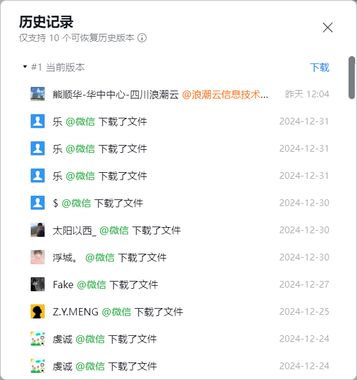
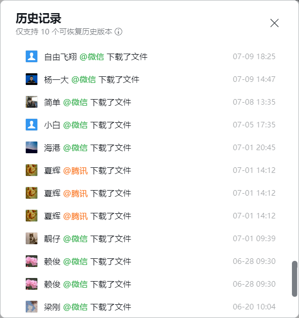
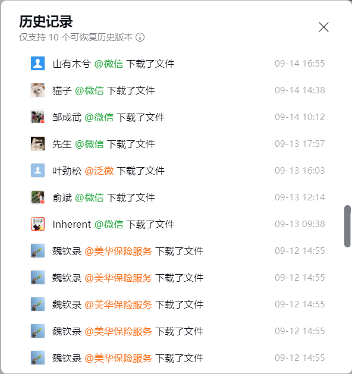
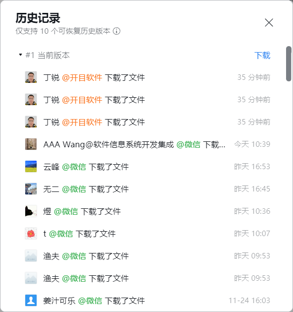

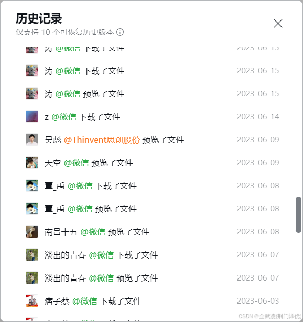

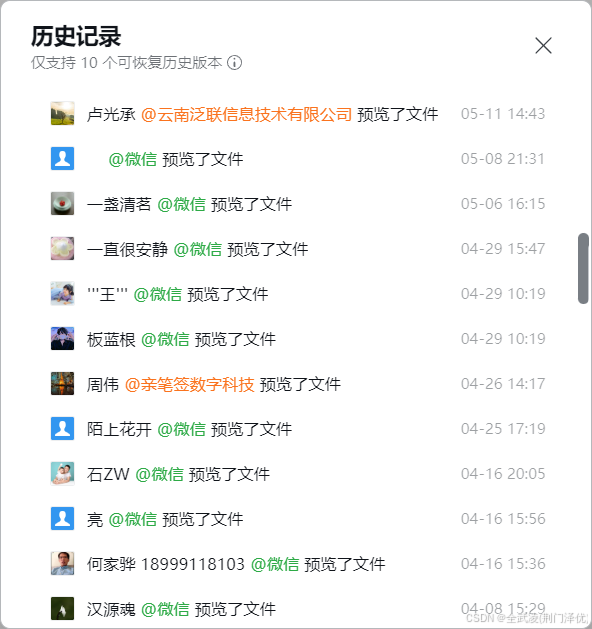
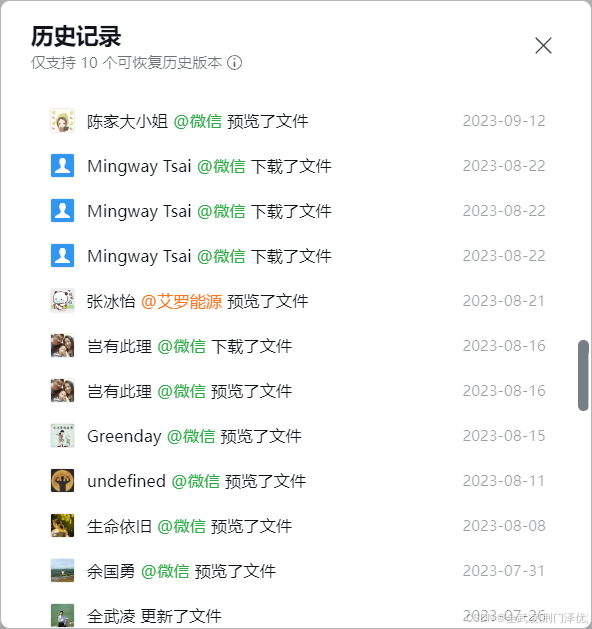
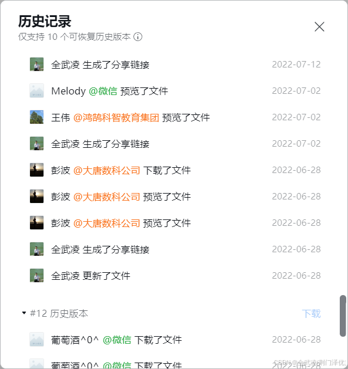

### 谁在下载授权器
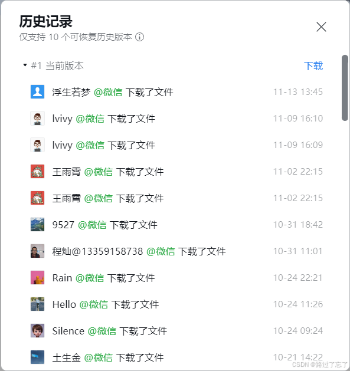

### 谁在申请源码版

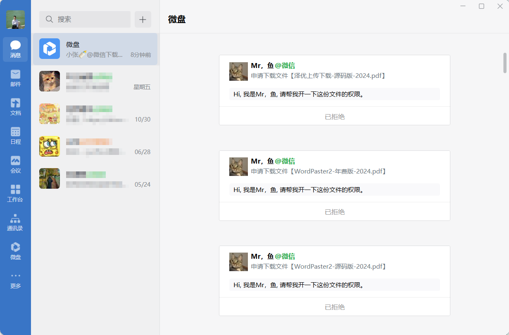
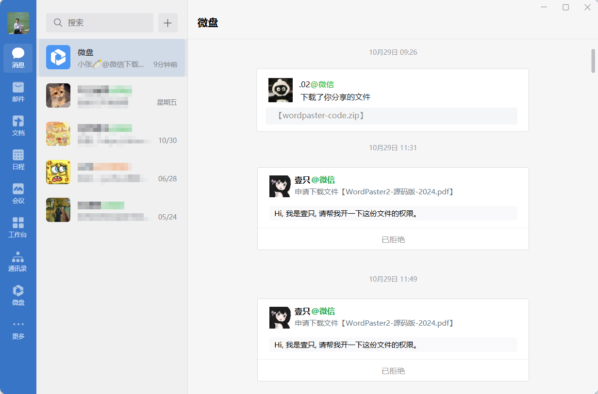
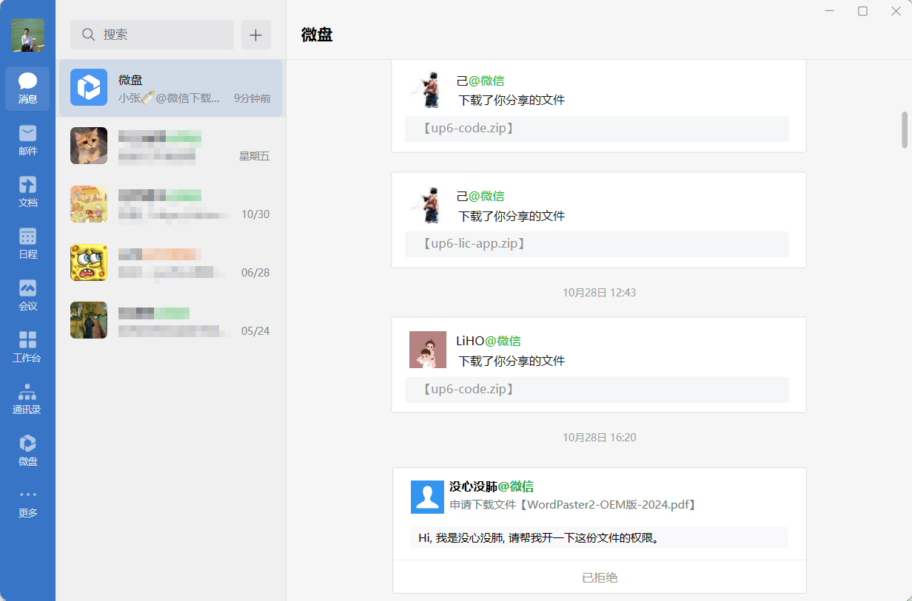
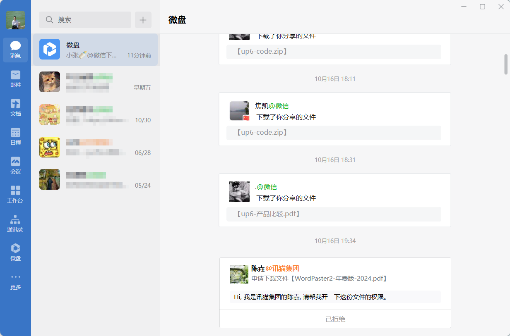
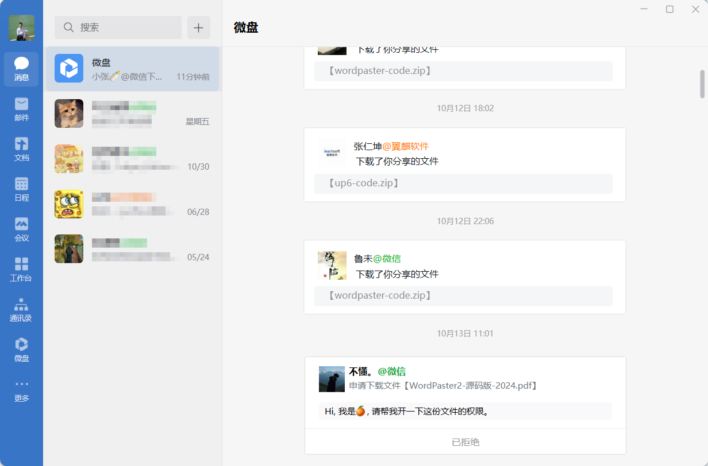

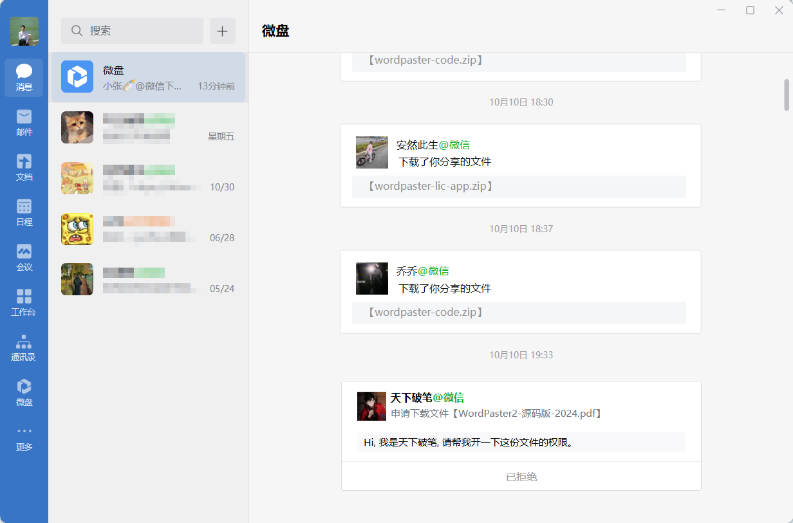
### 技术支持
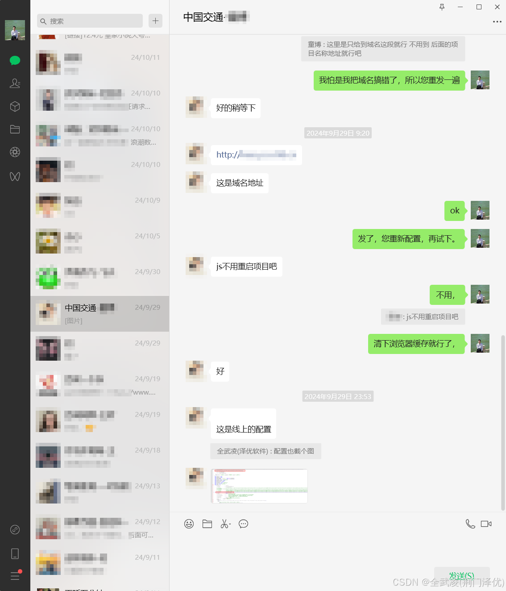

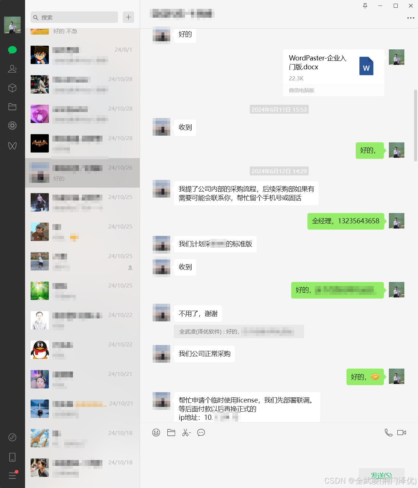

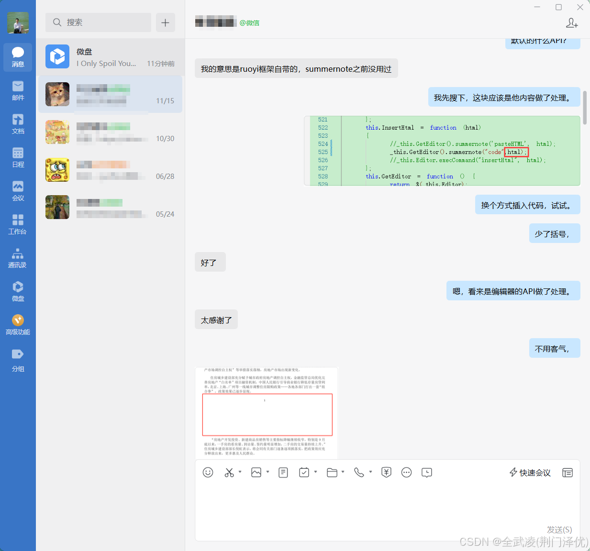

## 联系我们
QQ群：[223813913](http://shang.qq.com/wpa/qunwpa?idkey=24fd50b8d8aad7e7b81504d8ba35eea748cc56efa97f2a15b5b7afe1f4f413fe)  
微信：13235643658  
QQ：1269085759(技术)  
QQ：1085617561(商务)  
邮箱：qwl@ncmem.com

## 成功案例
中国人民解放军  
中国长江电力股份有限公司  
海信集团有限公司  
北京银联信科技股份有限公司  
优慕课在线教育科技（北京）有限责任公司  
西安工业大学  
西安恒谦教育科技股份有限公司  
西安德雅通科技有限公司  
国家气象中心  
国开泛在（北京）教育科技有限公司  
北京大唐融合通信技术有限公司  
北京思路创新科技有限公司  
北京兴油工程项目管理有限公司  
北京海泰方圆科技股份有限公司